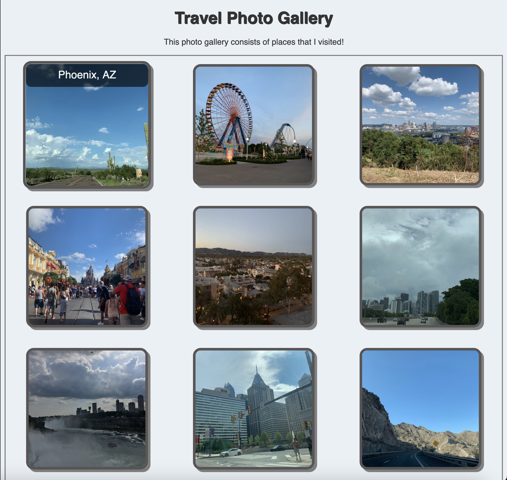
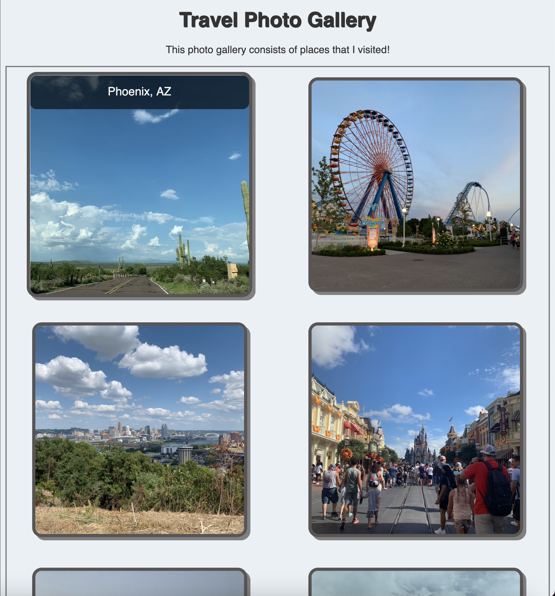
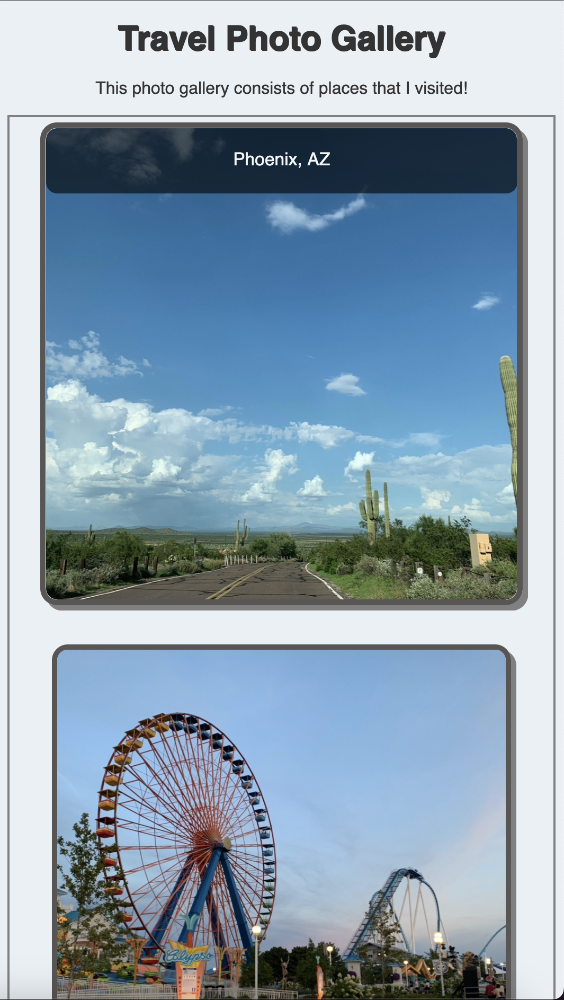

# My Travel Photo Gallery

This project is a responsive travel photo gallery built with **HTML** and **CSS Grid**. It showcases various places I have visited and adapts to different screen sizes for optimal viewing on desktop, tablet, and mobile devices.

## Features

- **Responsive Grid Layout:** The gallery adjusts the number of columns based on screen width.
- **Image Hover Effects:** Smooth hover effects reveal image captions with opacity transitions.
- **Clean and Modern Design:** Rounded images, subtle shadows, and soft background colors for an appealing look.
- **Accessible:** Includes meaningful 'alt' text for each image.

## How to View

[View the live site here](https://yanabrex.github.io/travel-gallery/)

## Screenshots

### Desktop View

### Tablet View

### Mobile View

## Technologies Used

- HTML5
- CSS3 (Grid layout, Transitions, Hover Effects)